# Projeto Driven n° 18: Freela ?

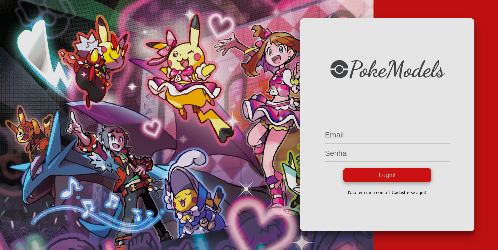

  O atual projeto é uma aplicação Full Stack, com banco de dados incluso, desenvolvido no curso de formação da Driven Education. A aplicação é uma rede social baseada em sites como Facebook e Instragam. As principais funcionalidades implementadas foram: cadastro e login de usuarios, login como visitante, cadastro de animais de estimação, visualização dos pets registrados, barra de pesquisa de outros animais e possibilidade de deixar os dados do seu animal de estimação como públicos ou privados para demais usuários. A principal tecnologia utilizada no front-end é o  React Vite, utilizando a biblioteca Axios para fazer requisições para a API.
  
  Se quiser experimentar as funcionalidades sem baixar localmente o código pode utilizar o link abaixo para acessar o deploy da API: 
  
  **[🚀 Link do Deploy](https://projeto18-freela-front-lilac.vercel.app/)**

  
  **[🐋 Link do Docker](https://hub.docker.com/repository/docker/jeftimeira/myimagename/general)**


## 📖 Índice
1. Visão Geral
2. Tecnologias
3. Banco de dados
4. Rotas
5. Como instalar ?
6. Como testar ?
7. Docker

## 📋 Visão Geral 
No site/aplicação o usuario pode acessar se fazer um cadastro, porém isso irá bloquear algumas funcionalidades. O principal intuito da página é exibir todos os modelos disponíveis no banco, informando o preço cobrado para participar de eventos/publicidade e o contato. Caso o usuario seja cadastrado, ele pode também adicionar os seus modelos na página. O usuario tem a opção de tornar o seu modelo indisponível, retirando ele da página principal e tornando privado suas informações de contato.

## 🛠️ Tecnologias
<table>
  <tr>
    <td align="center">
      <a href="https://pt.vitejs.dev/guide/">
        <br>
        <sub>
          <b>React Vite</b>
        </sub>
      </a>
    </td>
    <td align="center">
      <a href="https://styled-components.com/">
        <br>
        <sub>
          <b>Styled Components</b>
        </sub>
      </a>
    </td>
    <td align="center">
      <a href="https://axios-http.com/docs/intro">
        <br>
        <sub>
          <b>Axios.Js</b>
        </sub>
      </a>
    </td>
    <td align="center">
      <a href="https://docs.docker.com/guides/get-started/">
        <br>
        <sub>
          <b>Docker</b>
        </sub>
      </a>
    </td>
  </tr>
</table>
   
## 🚏 Rotas

### /:

  Página principal da aplicação onde o usuario entra pela primeira vez que acessa o site. Ele permite que o usuário efetue login caso não exista token salvo. O usuário pode opitar também por entrar como visitante clicando no logotipo, porém isso não dará acesso a todas as rotas do site.

<details>
<summary> <strong>Versão mobile:</strong>  </summary>
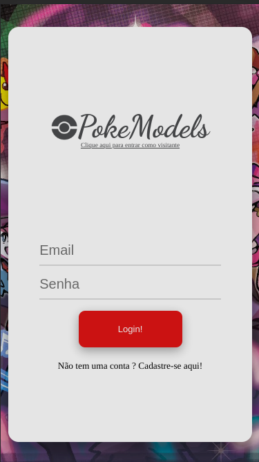
</details>

### /home:
  
  Página principal do site, local onde o usuario será redirecionado após fazer o login. É nessa página que o usuario vê os últimos pets cadastrados no banco.

<details>
<summary> <strong>Versão mobile:</strong>  </summary>
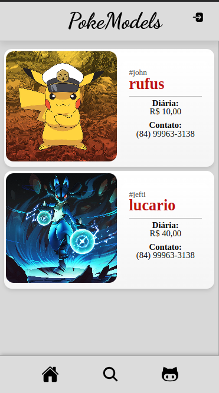
</details>

<details>
<summary> <strong>Tela de visitantes:</strong>  </summary>
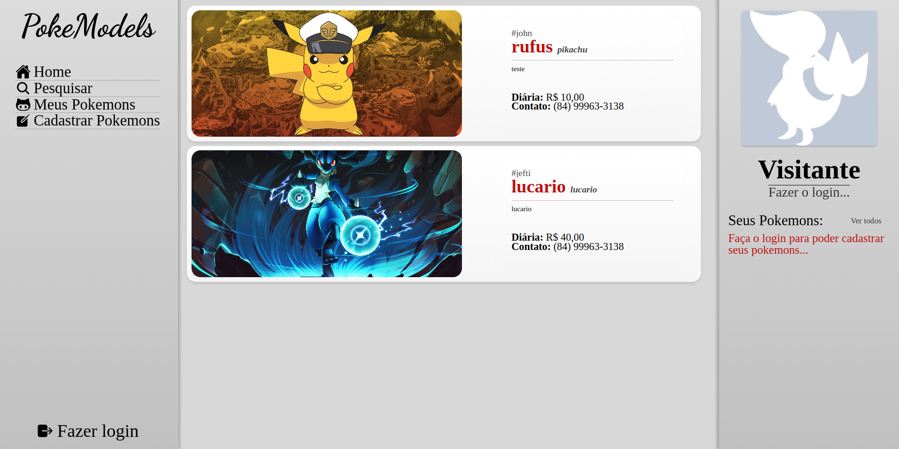
</details>

### /user:
  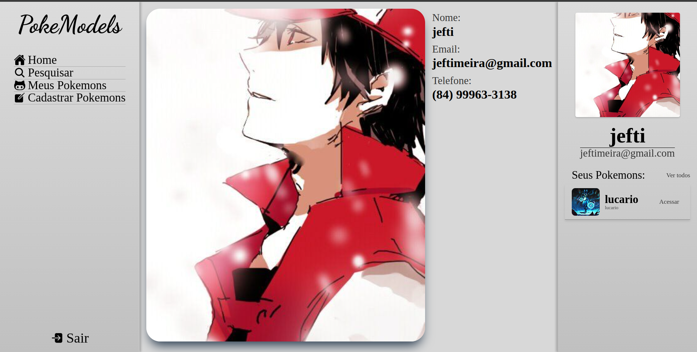
  Página de informações do próprio usuario, local onde ele consegue enxergar sua foto de perfil e suas informações de contato.

<details>
<summary> <strong>Versão mobile:</strong>  </summary>
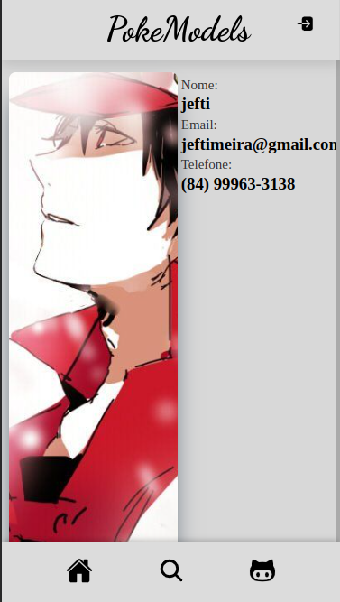
</details>

### /search:
  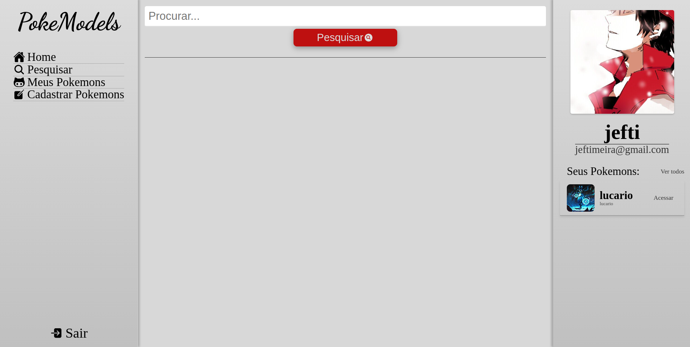
  Página de busca do site que permite o usuario pesquisar palavras-chaves. Os resultados da busca são exibidos abaixo da barra de pesquisa.

<details>
<summary> <strong>Versão mobile:</strong>  </summary>
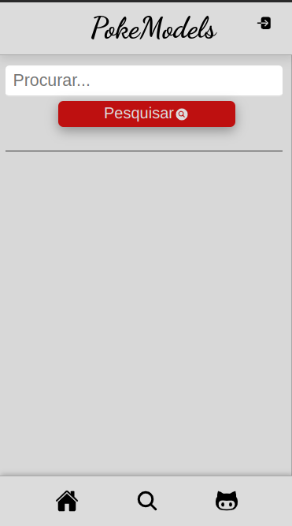
</details>
  
### /my:
  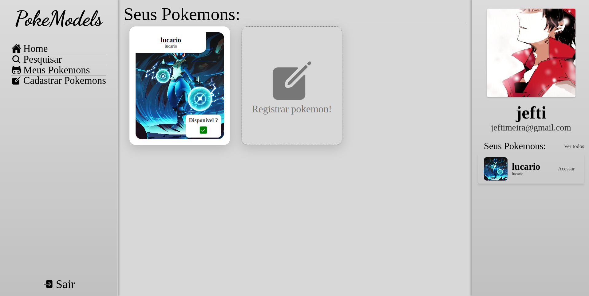
  Página de informações dos animais registrados pelo usuario, local onde ele pode deixar seus pets visiveis ou não para outros clientes.

<details>
<summary> <strong>Versão mobile:</strong>  </summary>
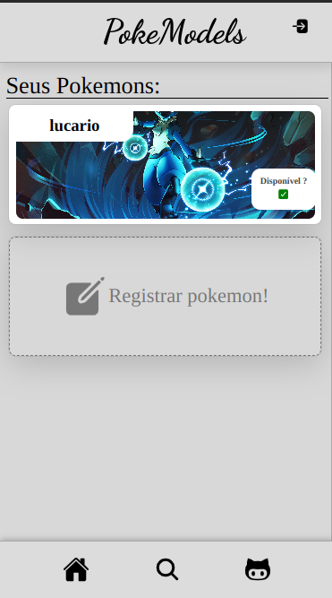
</details>

### /register:
  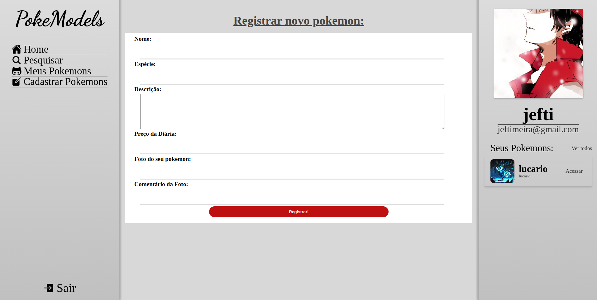
  Página de registro de modelos do site, local onde o usuário pode indica as informaçoes do seu modelo para fazer se cadastro no sistema.

  <details>
<summary> <strong>Versão mobile:</strong>  </summary>
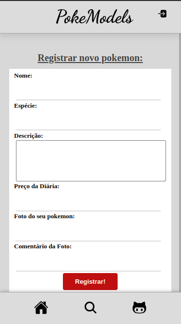
</details>

### /pokemon/:id :
  Página de informação de cada modelo individualmente, dependendo do id presente no link da página. É nessa página que o usuario pode ver as informções de contato do modelo e sua descrição.

### /* (página de erro):
  Página padrão de erro exibida todas as vezes que um cliente tenta acessa uma rota que não foi implementada, ela redireciona ou para o home ou para a página de login.
   
## ⚙️ Como instalar ?

- Para instalar e rodar localmente no seu computador o atual projeto é necessário ter instalado o client Mongo, para criar localmente o banco de dados de deploy, e a API rodando. Caso seu computador esteja dentro dos requisitos, os passos para instalar o programa são:

1. Baixe o repositório no seu computador de descompacte ele.
2. Abra em um programa capaz de roda-lo, como por exemplo o visual studio.
3. No terminal, insira o comando abaixo para instalar as dependências:
```javascript
npm i
```
4. Logo após, configure as variavés de ambiente criando os arquivos .env e .env.test. Para essa etapa funcionar corretamente é necessário subistituir as informações presentes por aquelas referentes a sua configuração.
```javascript
VITE_API_URL = #Variável responsável por definir qual o link da API que o site irá acessa quando for buscar informações.
```
Pronto, agora o código já está instalado e pronto para ser executado.

## 🏎 Como testar ?

- Para testar localmente o código você precisa fazer a aplicação rodar. execute o comando abaixo:
```javascript
npm run dev
```

Com a aplicação rodando em sua máquina, acesse o link informado para poder testar as funcionalidades da aplicação.

## 🐋 Docker

O Docker é uma plataforma de código aberto que automatiza a implantação, a escalabilidade e a gestão de aplicações em contêineres. Contêineres são unidades leves e portáveis que incluem tudo o que é necessário para executar uma aplicação, incluindo o código, as bibliotecas e as dependências. Eles isolam os processos da aplicação e garantem que ela seja executada de maneira consistente em diferentes ambientes.

Para usar o Docker para executar um aplicativo do Docker Hub, você pode seguir estes passos: 
### 1. Instale o Docker
  Pode encontrar mais informações de como instalar o Docker em sua máquina através do site oficial.

### 2. Baixe a imagem do aplicativo
  No terminal roda o seguinte comando.
```javascript
docker pull jeftimeira/myimagename:latest
```
### 3. Execute o contêiner do aplicativo
  Ainda no terminal execute o comando abaixo.
```javascript
docker run -d --name meu_app -p 8080:80 jeftimeira/myimagename:latest
```

Agora a aplicação estará rodando na porta 8080 da sua máquina e pode ser acessada pelo link: http://localhost:8080. É importante que a porta 8080 da sua máquina esteja livre e o backend esteja rodando na porta 3000 para rodar localmente o arquivo dockerizado. Caso a porta esteja ocupada no momento só subistituir o valor 8080 nos comandos anteriores pelo valor de alguma porta livre.

### Para remover o conteiner após utilizar
  Para remover a aplicação acesse novamente o terminal e execute os seguintes comandos em sequência.
```javascript
docker stop meu_app
docker rm meu_app
```

